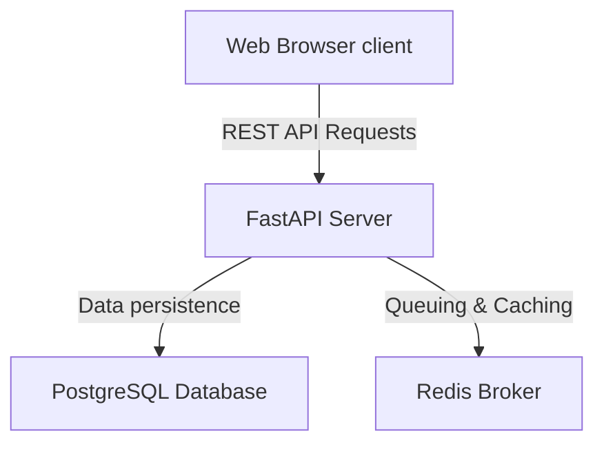
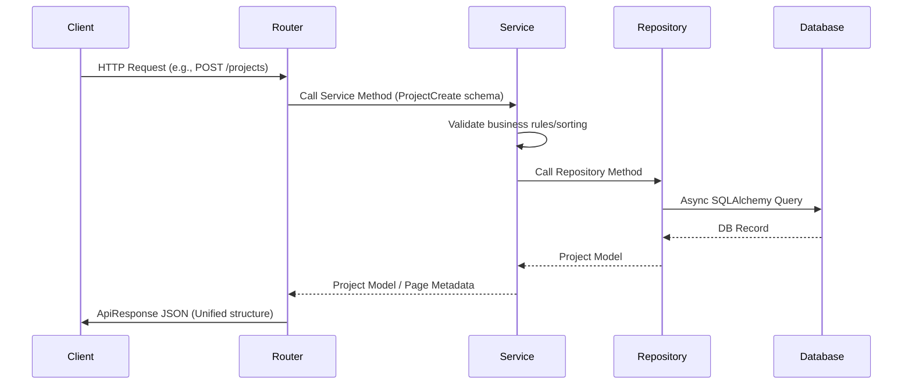

# Architecture Design

This document details the architectural decisions and system design of EvalForge.

## System Overview

EvalForge is structured as a decoupled monorepo containing a stateless web client (React/TS) and a web backend (FastAPI). It employs **Clean Architecture** patterns to separate infrastructure, data routing, and business logic.



---

## Backend Design (FastAPI)

We organize the Python codebase to follow strict separation of concerns:

- **api/**: The HTTP routing layer. Handles parsing HTTP methods, query params, request body validations, and returning unified JSON responses.
- **config/**: Stores environment configurations using Pydantic Settings.
- **core/**: Essential utilities that span the application (e.g. exception handling policies, dependency providers, Redis manager, and structured logging definitions).
- **database/**: Establishes database connections, manages async session lifecycles, and defines the Project repository.
- **models/**: SQLAlchemy models representing tables and relationships.
- **schemas/**: Pydantic models for request payload parsing and response serialization.
- **services/**: Contains pure business logic. API routing handlers call functions defined in this layer, which in turn calls the repository layer.
- **utils/**: Shared helper utilities (pagination, formatting, etc.).

### Repository-Service Pattern



---

## Observability & Security Middleware

1. **Request Correlation Tracing**: Every request is assigned a unique `Correlation ID` (UUIDv4) in the `RequestLoggingMiddleware`. This ID is stored in a thread/coroutine-safe contextvar (`structlog.contextvars`) and automatically injected into all logged records and the outgoing response headers (`X-Request-ID`), allowing trace-stitching across services.
2. **Unified API Response**: All success and error payloads follow a strict envelope:
   ```json
   {
     "success": true,
     "message": "Projects listed successfully.",
     "data": { ... },
     "timestamp": "2026-06-27T20:49:58Z",
     "request_id": "8b51d04f-0cb7-4a62-b72e-641d61685bc4"
   }
   ```
3. **Security Headers**: The `SecurityHeadersMiddleware` appends security protection headers to every outgoing request (e.g. `X-Frame-Options`, `Content-Security-Policy`, `X-Content-Type-Options`).

---

## Testing Architecture

We utilize `pytest` to run full integration checks. To prevent environmental dependencies when Docker services are not running during local/CI test execution:
1. **SQLite In-Memory**: We run tests against an in-memory SQLite database utilizing the `aiosqlite` async driver.
2. **Redis Mocking**: The active Redis connection manager is patched at the session level to respond with mock active health stats.

---

## Async Pipeline & Concurrency

Evaluations involve calling third-party LLMs which introduces high latency. 
- API endpoints that initiate runs will register a new job in the database.
- Jobs are queued using Redis as a message broker.
- Workers retrieve runs from the queue and perform evaluations asynchronously, updating the database status once complete.
- Client applications check run updates periodically or via SSE (Server-Sent Events) in the future.
