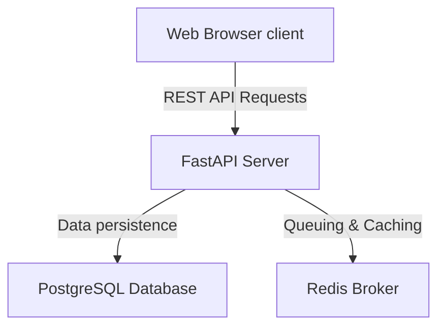

# Architecture Design

This document details the architectural decisions and system design of EvalForge.

## System Overview

EvalForge is structured as a decoupled monorepo containing a stateless web client (React/TS) and a web backend (FastAPI). It employs **Clean Architecture** patterns to separate infrastructure, data routing, and business logic.

---

## Backend Design (FastAPI)

We organize the Python codebase to follow strict separation of concerns:

- **api/**: The HTTP routing layer. Handles parsing HTTP methods, query params, request body validations, and returning serialized responses.
- **config/**: Stores environment configurations using Pydantic Settings.
- **core/**: Essential utilities that span the application (e.g. exception handling policies and structured logging definitions).
- **database/**: Establishes database connections, manages async session lifecycles, and defines the declarative Base.
- **models/**: SQLAlchemy models representing tables and relationships.
- **schemas/**: Pydantic models for request payload parsing and response serialization.
- **services/**: Contains pure business logic. API routing handlers must not execute operations directly; instead, they call functions defined in this layer.
- **utils/**: Shared helper utilities.

---

## Frontend Design (React)

The React client acts as a dashboard layer focused on interactive metrics visualization:

- **components/**: Shared layout primitives and input controllers.
- **pages/**: Route entry components representing dashboard panels.
- **hooks/**: Encapsulated React custom hooks.
- **services/**: Axios or Fetch clients configured to communicate with the REST API.
- **layouts/**: Shell wrappers containing navigational navigation.
- **styles/**: Customized styling tokens matching the vanilla design system.

---

## Async Pipeline & Concurrency

Evaluations involve calling third-party LLMs which introduces high latency. 
- API endpoints that initiate runs will register a new job in the database.
- Jobs are queued using Redis as a message broker.
- Workers retrieve runs from the queue and perform evaluations asynchronously, updating the database status once complete.
- Client applications check run updates periodically or via SSE (Server-Sent Events) in the future.
