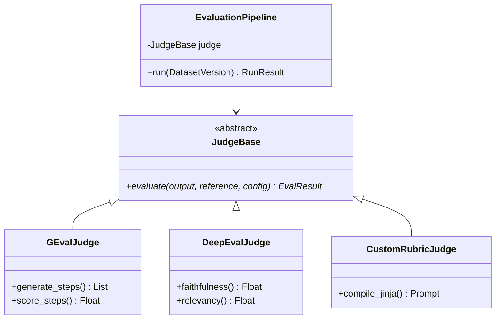

# System Architecture Design

This document details the architectural decisions, design patterns, and component topologies of the **EvalForge** platform.

---

## 1. Architectural Style & Monorepo Layout

EvalForge is structured as a decoupled monorepo, separating a stateless single-page web application (`frontend/`) from a high-throughput, async-native API gateway (`backend/`).

The project adheres strictly to **Clean Architecture** and **Domain-Driven Design (DDD)** concepts, ensuring business rule isolation from transport layers and database dependencies.

```mermaid
graph TB
    subgraph Client Layer
        Browser[SPA Browser UI]
        CLI[EvalForge CLI]
        SDK[Python/TS SDK Clients]
    end

    subgraph API Gateway (FastAPI)
        AuthMW[JWT & RBAC Middleware]
        TenantMW[Tenant Scoping Context]
        Router[API Routers]
    end

    subgraph Evaluation Engine
        JudgeBase[JudgeBase Interface]
        ConcreteJudges[G-Eval / DeepEval / Custom]
    end

    subgraph Async Processing
        Broker[(Redis Queue)]
        Workers[Celery Worker Cluster]
    end

    subgraph Persistence Layer
        DB[(PostgreSQL Database)]
        Storage[Local/S3 Dataset Storage]
    end

    Browser & CLI & SDK -->|REST API| AuthMW
    AuthMW --> TenantMW --> Router
    Router -->|Dispatch Tasks| Broker
    Broker --> Workers
    Workers --> JudgeBase
    JudgeBase --> ConcreteJudges
    Router --> DB
    Workers --> DB
    Workers --> Storage
```

---

## 2. Multi-Tenant SaaS Isolation Model

EvalForge implements organization-level multitenancy:
- **Organizations**: The top-level administrative boundary. Subscriptions and usage quotas are tracked at the organization level.
- **Workspaces / Teams**: Mid-level groupings. Projects, datasets, and runs belong to a workspace.
- **Role-Based Access Control (RBAC)**: Custom middleware inspects authentication context and permits execution based on role hierarchy:
  $$\text{Viewer} \subset \text{Member} \subset \text{Team Admin} \subset \text{Org Admin}$$
- **Data Scoping Middleware**: A tenant filter is injected into the database session lifecycle, automatically appending `org_id` clauses to all select, update, and delete actions.

---

## 3. Evaluation Engine Architecture

The core evaluation logic is decoupled using a Provider/Judge abstraction model.

```mermaid
classDiagram
    class JudgeBase {
        <<abstract>>
        +evaluate(output, reference, config) EvalResult*
    }
    class GEvalJudge {
        +generate_steps() List
        +score_steps() Float
    }
    class DeepEvalJudge {
        +faithfulness() Float
        +relevancy() Float
    }
    class CustomRubricJudge {
        +compile_jinja() Prompt
    }
    JudgeBase <|-- GEvalJudge
    JudgeBase <|-- DeepEvalJudge
    JudgeBase <|-- CustomRubricJudge
    class EvaluationPipeline {
        -JudgeBase judge
        +run(DatasetVersion) RunResult
    }
    EvaluationPipeline --> JudgeBase
```

### 3.1 Judicative Pipelines
1. **G-Eval (Chain-of-Thought)**: First constructs step-by-step criteria instructions dynamically from the metric definition, and then executes step-level evaluation and weight averaging.
2. **DeepEval Wrapper**: Wraps domain-specific evaluators (hallucination scoring, factual recall, and contextual relevance).
3. **Custom Rubric Judicature**: Compiles Jinja2 prompt layouts, letting developers write personalized judge templates.

---

## 4. Asynchronous Task Orchestration

LLM evaluation is inherently high-latency due to remote inference. EvalForge handles this asynchronously:
1. **API Handshake**: The API receives the run submission, verifies quotas, creates a DB record with a `PENDING` state, and returns a `202 Accepted` response with a polling URL.
2. **Task Enqueuing**: The task is dispatched to Redis via Celery, categorized into priority queues:
   - `high`: CI/CD automation pipelines.
   - `default`: User-facing interactive runs.
3. **Progress Broadcasting**: Celery workers stream real-time task progress (completion ratios) via a WebSocket server or SSE fallback, keeping user interfaces synced instantly.
4. **Retry Handling**: Per-test-case retry loops handle rate limits and transient connection timeouts with exponential backoff.

---

## 5. Observability Stack

- **Request ID Tracking**: Correlation IDs are attached to HTTP context and threaded to all log statements using `structlog`.
- **Metrics Scraping**: Prometheus gathers performance metrics (endpoint response distributions, queue depth, Celery thread saturation).
- **Grafana Dashboard**: Visual templates show request latencies, evaluation success rates, and token consumption statistics.
