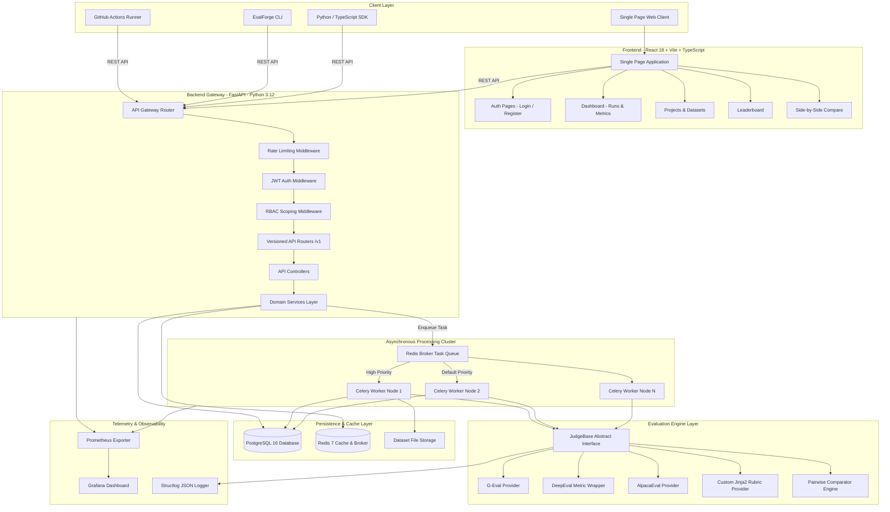
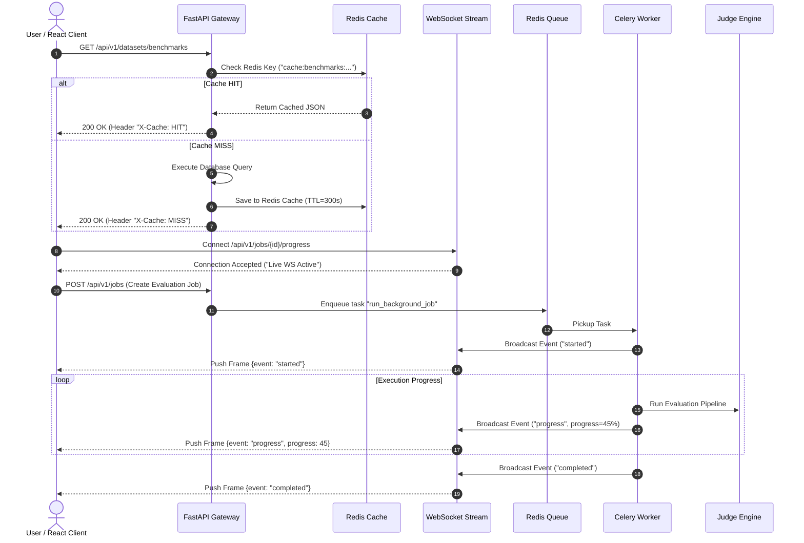
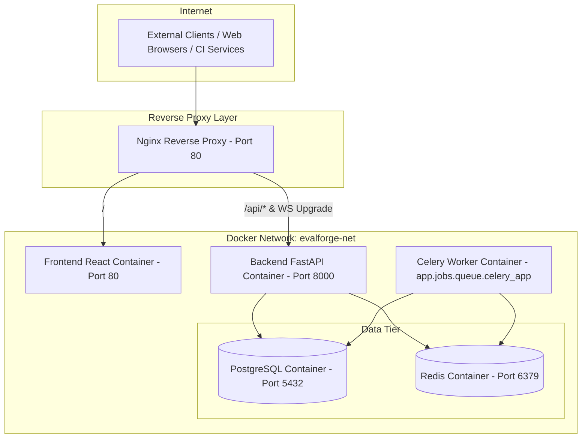

# High-Level Design (HLD) Document

## Project Name: EvalForge
**Document Version:** 1.0.0  
**Status:** Released / Active  
**Author:** Software Architecture Team  
**Target Audience:** Software Architects, DevOps Engineers, Senior Developers  

---

## 1. Executive Summary & System Overview

**EvalForge** is designed as a high-throughput, asynchronous, decoupled monorepo architecture. It separates client-facing single-page application (SPA) frontends from high-performance, async-native API gateways and horizontal background processing worker clusters.

The architecture strictly adheres to **Clean Architecture** and **Domain-Driven Design (DDD)** principles, isolating core domain evaluation logic from transport layers and persistence backends.

---

## 2. High-Level System Architecture Diagram

The topology below depicts the flow from client interfaces through API gateways, asynchronous worker clusters, evaluation engine abstraction layers, and persistence storage:

---

## 3. Component Architecture & Responsibilities

### 3.1 Frontend Subsystem (`frontend/`)
- **Technology Stack:** React 18, Vite, TypeScript, Tailwind CSS, Recharts, Lucide Icons.
- **Responsibilities:**
  - Responsive Single-Page Application (SPA) rendering.
  - Interactive evaluation run triggering, real-time WebSocket progress polling, metric visualisations.
  - Side-by-side comparative views for model outputs and judge reasoning summaries.
  - Authentication management (JWT storage in memory / httpOnly cookie).

### 3.2 Backend API Subsystem (`backend/`)
- **Technology Stack:** Python 3.12, FastAPI, Pydantic v2, Async SQLAlchemy 2.0.
- **Responsibilities:**
  - Ingress request validation and authentication (JWT validation, API Key hashing checks).
  - Multi-tenant data scoping (`org_id` context injection).
  - Asynchronous HTTP request handling ensuring main event loops are never blocked by evaluation compute.
  - REST endpoint routers (`/auth`, `/projects`, `/datasets`, `/runs`, `/metrics`).

### 3.3 Evaluation Engine Core (`backend/app/engine/`)
- **Design Pattern:** Strategy Pattern via `JudgeBase` Abstract Base Class.
- **Responsibilities:**
  - Normalizing input datasets, prompt definitions, and LLM output targets.
  - Dynamically executing judge pipelines (G-Eval CoT step generation, DeepEval evaluation, Jinja2 template rendering).
  - Standardizing scoring metrics to normalized floating-point scales (0.0 to 1.0 or 1.0 to 10.0).

### 3.4 Asynchronous Worker Subsystem (`backend/app/tasks/`)
- **Technology Stack:** Celery, Redis Broker.
- **Responsibilities:**
  - Processing long-running evaluation benchmarks across distributed worker instances.
  - Managing high-priority CI/CD runs vs. default priority batch processing.
  - Executing concurrent LLM API calls with backoff retries on rate limits (HTTP 429).
  - Atomic persistence of run state transitions (`PENDING` $\rightarrow$ `RUNNING` $\rightarrow$ `COMPLETED`).

### 3.5 Scheduled Jobs & Periodic Cron Subsystem (`backend/app/jobs/scheduler/`)
- **Technology Stack:** Asyncio Periodic Loop, Celery Beat.
- **Responsibilities:**
  - Managing automated background schedules (`CronSchedulerManager`).
  - Periodically updating leaderboard model rankings (`cron-leaderboard-recalc`).
  - Purging stale job execution logs and temporary evaluation artifacts (`cron-stale-logs-cleanup`).
  - Aggregating live system throughput and latency metrics (`cron-metrics-aggregation`).
  - Exposing REST management endpoints (`/api/v1/jobs/scheduler/`) and React UI panel.

### 3.6 Storage & Persistence Layer
- **PostgreSQL 16:** Relational storage for organizations, workspaces, users, projects, dataset versions, run metadata, and metric results.
- **Redis 7:** Celery task broker, endpoint response cache engine (`X-Cache: HIT/MISS`), rate limiter counter storage, real-time pub/sub.
- **File Storage:** Local filesystem or Amazon S3 compatible object storage for dataset uploads and raw test artifacts.

---

## 4. System Data Flow & Sequences

### 4.1 Evaluation Run Trigger & Asynchronous Execution Flow

---

## 5. Security & Multi-Tenancy Architecture

### 5.1 Multi-Tenant Isolation Model
EvalForge uses an **Organization-Workspace Hierarchy**:
- **Organization (Top Level):** Boundary for billing, subscription plans, usage quotas, and administrative permissions.
- **Workspace (Mid Level):** Logical partition within an organization (e.g., "Staging", "Production", "Team-Alpha").
- **Tenant Context Injection:** FastAPI middleware extracts `org_id` and `workspace_id` from claims/API keys and injects them into the SQLAlchemy session context. Every database query is automatically scoped:
$$\text{SELECT } * \text{ FROM dataset WHERE org\_id} = :context\_org\_id$$

### 5.2 Role-Based Access Control (RBAC) Matrix

| Action | Viewer | Member | Team Admin | Org Admin |
|---|:---:|:---:|:---:|:---:|
| View Dashboard & Leaderboard | ✅ | ✅ | ✅ | ✅ |
| Execute Evaluation Runs | ❌ | ✅ | ✅ | ✅ |
| Upload & Version Datasets | ❌ | ✅ | ✅ | ✅ |
| Manage Workspace API Keys | ❌ | ❌ | ✅ | ✅ |
| Manage Org Billing & Members | ❌ | ❌ | ❌ | ✅ |

---

## 6. Network Topology & Deployment Architecture

---

## 7. Scalability & High Availability Strategy

1. **Stateless API Layer:** FastAPI nodes run statelessly behind a load balancer; horizontally scalable without session affinity requirements.
2. **Worker Pool Autoscale:** Celery worker containers scale up dynamically based on Redis task queue saturation (`celery_queue_length > threshold`).
3. **Database Connection Pooling:** Managed via SQLAlchemy `QueuePool` with statement caching and read-replica distribution support.
4. **Resilience & Rate Limiting:** Circuit breakers and backoff retries prevent external LLM API rate-limit errors from crashing worker tasks.
