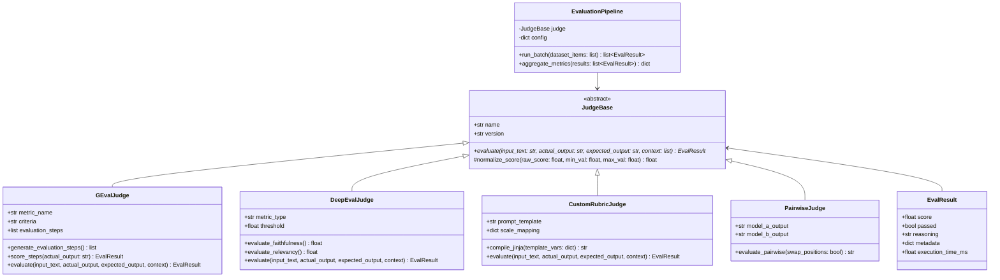
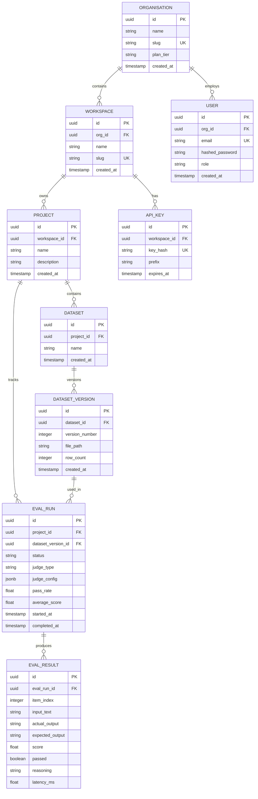
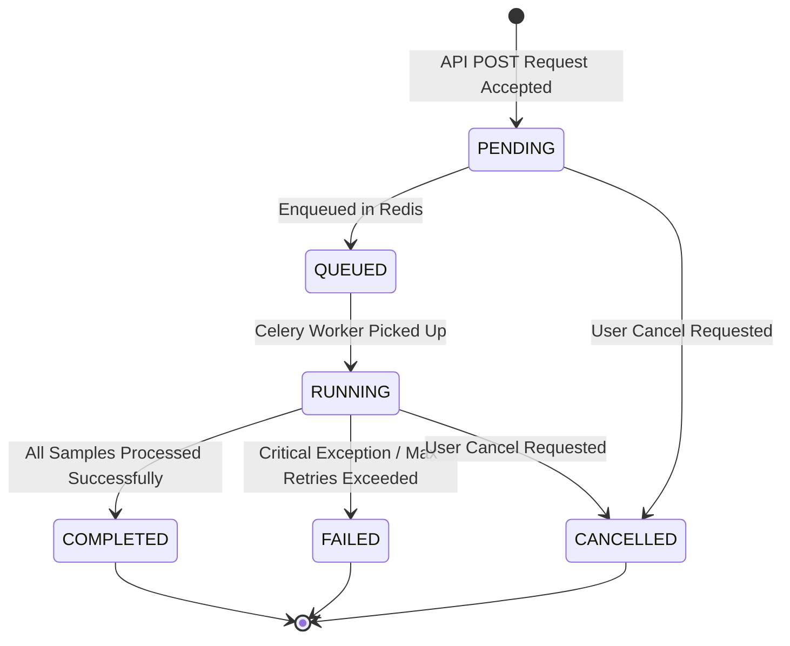

# Low-Level Design (LLD) Document

## Project Name: EvalForge
**Document Version:** 1.0.0  
**Status:** Released / Active  
**Author:** Technical Design & Core Engineering Team  
**Target Audience:** Core Developers, Maintainers, Code Reviewers  

---

## 1. Class & Object Design

### 1.1 Evaluation Engine Class Hierarchy
The core evaluation engine is designed around an extensible interface using the Strategy design pattern.



---

## 2. Database Schema & Data Models

### 2.1 Entity-Relationship (ER) Diagram



### 2.2 Table Specifications

#### Table: `organisations`
| Column | Type | Constraints | Description |
|---|---|---|---|
| `id` | UUID | Primary Key, default `gen_random_uuid()` | Unique org identifier |
| `name` | VARCHAR(255) | NOT NULL | Organization name |
| `slug` | VARCHAR(255) | UNIQUE, NOT NULL | URL-friendly unique slug |
| `plan_tier` | VARCHAR(50) | NOT NULL, DEFAULT `'free'` | Subscription level (`free`, `pro`, `enterprise`) |
| `created_at` | TIMESTAMPTZ | NOT NULL, DEFAULT `now()` | Timestamp created |

#### Table: `eval_runs`
| Column | Type | Constraints | Description |
|---|---|---|---|
| `id` | UUID | Primary Key | Unique evaluation run ID |
| `project_id` | UUID | Foreign Key $\rightarrow$ `projects.id` | Target project |
| `dataset_version_id` | UUID | Foreign Key $\rightarrow$ `dataset_versions.id` | Target dataset version |
| `status` | VARCHAR(50) | NOT NULL, DEFAULT `'PENDING'` | State (`PENDING`, `RUNNING`, `COMPLETED`, `FAILED`) |
| `judge_type` | VARCHAR(100) | NOT NULL | Evaluator type (`g_eval`, `deepeval`, `custom`) |
| `judge_config` | JSONB | NOT NULL, DEFAULT `'{}'` | Evaluator hyperparameters |
| `pass_rate` | FLOAT | NULLABLE | Overall percentage of test cases passed (0.0 – 1.0) |
| `average_score` | FLOAT | NULLABLE | Mean score across all evaluated samples |
| `started_at` | TIMESTAMPTZ | NULLABLE | Execution start timestamp |
| `completed_at` | TIMESTAMPTZ | NULLABLE | Execution completion timestamp |

---

## 3. REST API Specification

### 3.1 Endpoint Summary Table

| Method | Endpoint Path | Auth Required | Description |
|---|---|:---:|---|
| `POST` | `/api/v1/auth/register` | No | Register new user and organization |
| `POST` | `/api/v1/auth/login` | No | Authenticate user & issue JWT bearer token |
| `POST` | `/api/v1/projects` | JWT | Create a new project workspace |
| `GET` | `/api/v1/projects/{id}` | JWT | Fetch project metadata & run history |
| `POST` | `/api/v1/datasets/upload` | JWT / API Key | Upload dataset file and create immutable version |
| `POST` | `/api/v1/runs` | JWT / API Key | Trigger an asynchronous evaluation run |
| `GET` | `/api/v1/runs/{id}` | JWT / API Key | Poll run execution status and summary metrics |
| `GET` | `/api/v1/runs/{id}/results` | JWT / API Key | Paginated result details for individual test items |
| `GET` | `/api/v1/metrics/leaderboard` | JWT | Aggregated model performance leaderboard |

---

### 3.2 Key API Contract Examples

#### Trigger Evaluation Run: `POST /api/v1/runs`
- **Request Headers:**
  ```http
  Authorization: Bearer <JWT_TOKEN>
  Content-Type: application/json
  ```
- **Request Body:**
  ```json
  {
    "project_id": "9b1deb4d-3b7d-4bad-9bdd-2b0d7b3dcb6d",
    "dataset_version_id": "11a2b3c4-d5e6-7f8a-9b0c-1d2e3f4a5b6c",
    "judge_type": "g_eval",
    "judge_config": {
      "metric_name": "Coherence",
      "criteria": "Assess whether the model output is logically structured, coherent, and free of contradictions.",
      "threshold": 0.7,
      "model": "gpt-4o"
    },
    "priority": "high"
  }
  ```
- **Response `202 Accepted`:**
  ```json
  {
    "run_id": "fe5e4d3c-2b1a-0f9e-8d7c-6b5a4f3e2d1c",
    "status": "PENDING",
    "created_at": "2026-08-03T15:30:00Z",
    "status_url": "/api/v1/runs/fe5e4d3c-2b1a-0f9e-8d7c-6b5a4f3e2d1c"
  }
  ```

---

## 4. Algorithms & Core Mechanics

### 4.1 G-Eval Chain-of-Thought (CoT) Algorithm
The G-Eval scoring pipeline operates in two main phases:

```
Algorithm 1: G-Eval Execution
Input: Criteria C, Input X, Model Output Y, Judge Model M
Output: Normalized Score S in range [0, 1], Reasoning R

Phase 1: Chain-of-Thought Generation
1. Construct Prompt: P_step = "Given the evaluation criteria: '{C}', generate 4-5 step-by-step evaluation instructions."
2. Call LLM: Steps = M.generate(P_step)

Phase 2: Step-by-Step Scoring
3. Construct Scoring Prompt:
   P_score = "Criteria: {C}\nEvaluation Steps: {Steps}\nInput: {X}\nOutput: {Y}\n"
             "Provide a score from 1 to 5 and explain your reasoning."
4. Call LLM: (RawScore, Reasoning) = M.generate(P_score)
5. Compute Normalized Score: S = (RawScore - 1) / 4.0
6. Return EvalResult(score=S, reasoning=Reasoning, passed=(S >= threshold))
```

---

### 4.2 Rate Limit Backoff Algorithm
Worker nodes handle LLM provider rate limits (HTTP 429) using exponential backoff with jitter:

$$\text{Backoff Delay (seconds)} = \min\left(\text{max\_delay}, \text{base\_delay} \times 2^{\text{attempt}} + \text{uniform}(0, 1)\right)$$

- `base_delay` = 1.0s
- `max_delay` = 60.0s
- `max_retries` = 5

---

## 5. Evaluation Run State Machine

The run execution lifecycle follows strict status transition boundaries:



---

## 6. Error Handling & Standard Response Envelope

All API error responses follow a standard error contract:

```json
{
  "error": {
    "code": "DATASET_VERSION_NOT_FOUND",
    "message": "Dataset version 11a2b3c4-d5e6-7f8a-9b0c-1d2e3f4a5b6c does not exist in this project.",
    "details": {},
    "timestamp": "2026-08-03T15:35:00Z",
    "request_id": "req-987654321"
  }
}
```
