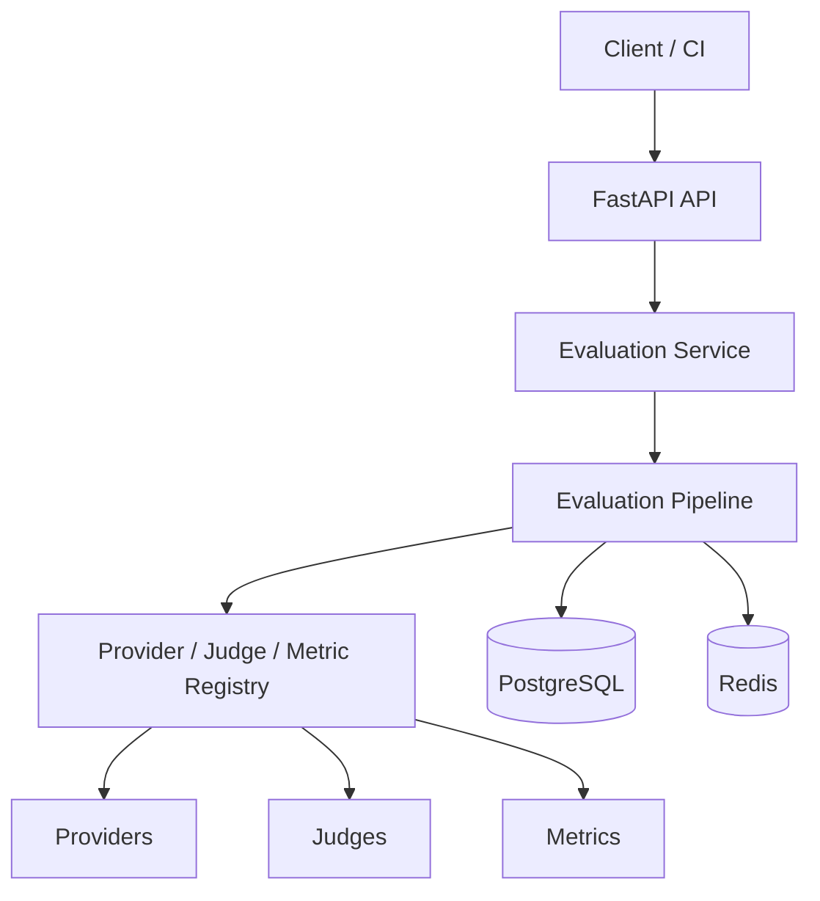

# Architecture Diagram

## Notes

- The API layer stays thin and delegates execution to services.
- Registries provide plugin-style discovery without manual wiring.
- Batch execution persists partial progress and failure details.
