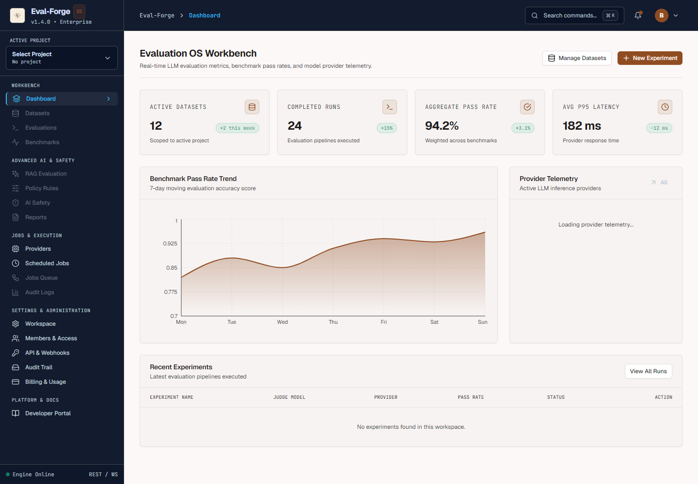
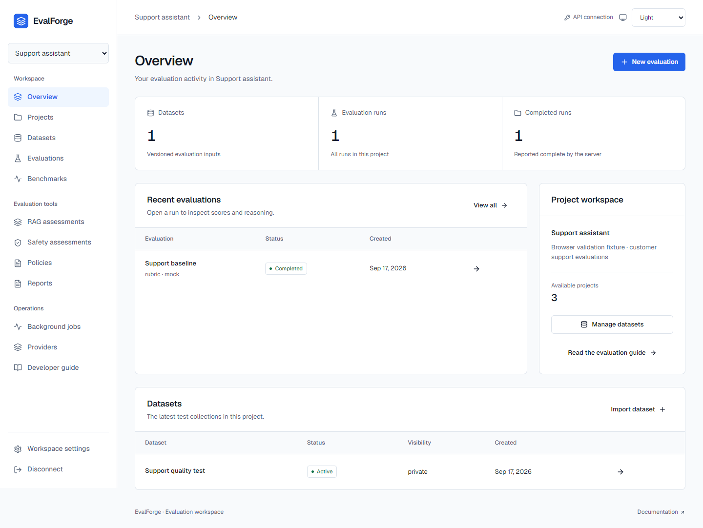
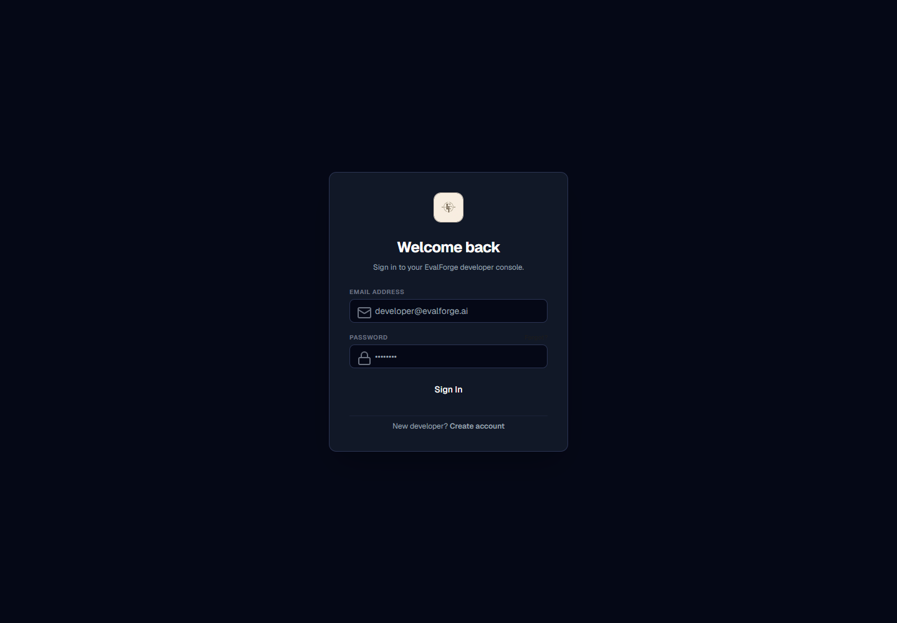
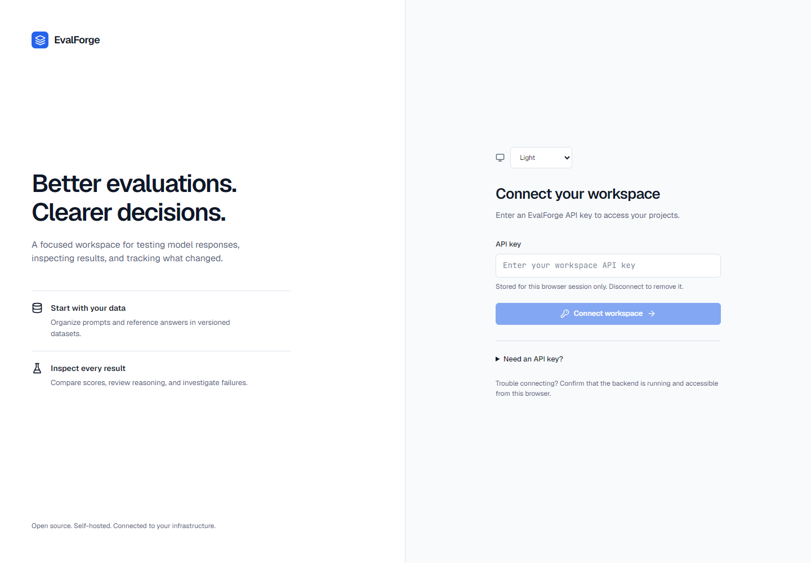

# UI release review

## Scope

The existing React/TypeScript/Vite/Tailwind interface is rebuilt around neutral surfaces, blue actions, Geist, JetBrains Mono, a 240px sidebar and shared light/dark styles. The default follows the system theme. Navigation, forms, tables, native dialogs, errors and empty states use the same components throughout.

Authentication now validates an API key against the backend. The old fabricated email/password session and silent mock API fallbacks are removed. Keys use session storage and query caches are cleared on disconnect. Dataset import, evaluation configuration/execution, versioned records, results and job progress use actual backend contracts. Zero counts stay zero; unavailable data displays an error. Demo mode is explicit, read-only and excluded from production behavior.

## Supported interface

- Connect/disconnect; select and create projects; edit project settings.
- Create datasets, import CSV/JSON/JSONL, browse versions and records.
- Configure and execute an evaluation, inspect stored metrics and test-case results.
- Browse/create benchmark suites and policies; browse pipeline-supplied RAG/safety assessments.
- Generate/download reports; browse jobs and logs; inspect authenticated SSE progress with bounded polling fallback; confirm retry/cancel actions.
- Read the provider catalog, connection scope, system status and authorized organization records.

User-managed scheduling, email/password accounts, provider-key editing and SSO configuration are outside launch navigation. The scheduling route explains its availability. Registered providers are not labeled configured or healthy. RAG/safety pages show measurements supplied by the pipeline and do not claim to run an unimplemented assessment engine.

## Confirmed security repairs

| Finding | Repair and coverage |
| --- | --- |
| Workspace-scoped jobs could bypass isolation through unscoped keys; job pagination stopped after 1,000 records | Authorize against the project's workspace for every access; filter/count in SQL. Regression covers cross-workspace denial and 1,005 jobs. |
| A fast worker could start before the job was marked queued | Commit the QUEUED state before Celery dispatch; regression asserts state at dispatch. |
| API-key scope strings were not enforced; issuance could escape the parent workspace | Enforce read/write resource scopes, inherit workspace/organization, reject broader scopes and foreign revocation. Tests use real hashed keys. |
| Response idempotency keys were shared between callers and could replay after revocation | Hash credential, method, URL and body into the cache key; revalidate authorization before replay; exclude key-generation responses and file uploads. |
| Evaluation input could choose the Ollama network destination | Only the administrator-configured server URL is accepted; metadata-address override regression. |
| Webhook validation resolved DNS separately from delivery | Pin the HTTP connection to a validated public IP, retain Host/TLS SNI, disable redirects and environment proxies; tests cover DNS rebinding. |
| Workspace keys could control the global scheduler | Require explicit server-scheduler administration scope. |
| Provider credential errors could invalidate the UI's workspace session | Return a provider-service error rather than a workspace-authentication 401. |
| A mixed production CORS list could include a wildcard | Reject wildcard membership anywhere in the production list. |

React renders data as text. Nested secret fields and recognizable key strings are redacted in record/error displays. The production Nginx configuration prohibits inline/eval scripts and buffers neither SSE nor its proxy responses.

This is a source review with focused regression tests, not an independent penetration test or a Cloudflare account audit. No Cloudflare installation or production deployment was performed.

## Validation

Local checks: **188 backend/SDK/CLI tests + 2 added bootstrap/dispatch regressions, 8 frontend unit tests, and 17 browser tests passed**. Type checking, ESLint, Prettier, Ruff, Black and the production build passed. Dependency audits found **0 known vulnerabilities** in the frontend and in all 73 installed external Python packages. Existing Python deprecation warnings remain; they do not fail the suite. The browser matrix recorded zero Axe WCAG A/AA violations and no unintended document overflow.

The bootstrap regression provisions a workspace and verifies its key can authenticate and read owner-authorized organization membership. Validation details are in [validation.json](ui-evidence/validation.json). Automated accessibility checks were supplemented by keyboard testing and visual review of all six route contact sheets and full-size core screens; they do not substitute for an assistive-technology user study.

| Before | After |
| --- | --- |
|  |  |
|  |  |

[Dark desktop](ui-evidence/after-overview-dark-1440.png) · [Mobile dark](ui-evidence/after-overview-dark-375.png) · [Mobile light](ui-evidence/after-overview-light-375.png) · [Evaluation setup](ui-evidence/after-new-evaluation.png) · [Mobile import](ui-evidence/after-import-mobile.png)

Screenshots use the isolated browser-test fixtures. Their records and mock-provider scores are test data, not production activity. The browser suite uses real FastAPI authentication, routing, SQLite persistence, CSV import and evaluation execution with the explicit mock provider. It covers all 29 route variants at 375/768/1440 pixels in both themes, accessibility scans, keyboard dialog/drawer focus, invalidation, forbidden resources, malformed responses, network failures, project-switch races and job stream cleanup.

## Remaining environment-dependent launch gates

Docker is not installed on the local host; the Docker Compose build passed on GitHub Actions. Production PostgreSQL migrations, Redis/Celery execution, Nginx container startup, HTTPS, deployed CORS and a real external-provider run must be validated in the intended deployment. Local browser tests use temporary SQLite and a mock LLM, and do not establish those production capabilities. All four CI jobs passed on commit cc38d37, including the Linux browser suite and Docker build. CI status must also be checked on the final PR head. The upstream Vercel check requires maintainer authorization for fork deployments. These limits prevent an unconditional production-readiness claim.

No production data, credentials, deployment or merge is part of this change. See [setup](ui-setup.md) for required services and API-key provisioning.
